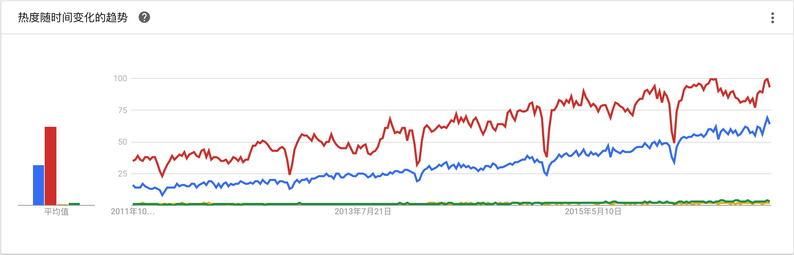
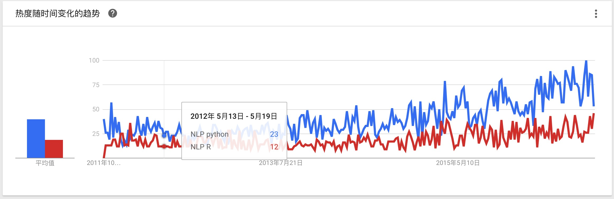
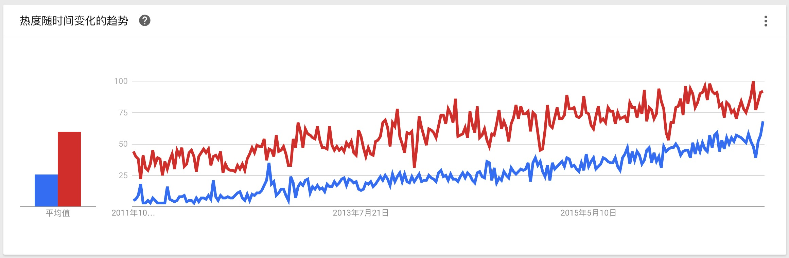
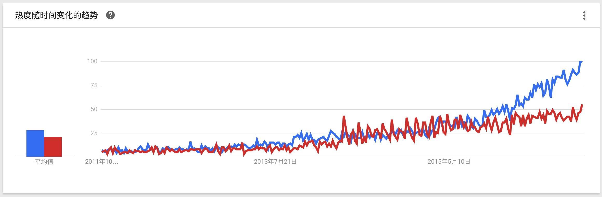
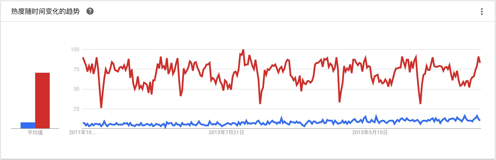
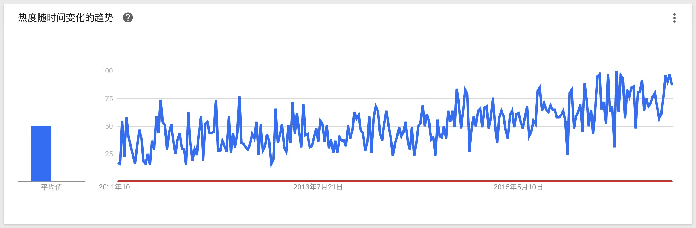
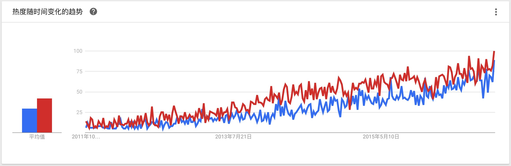
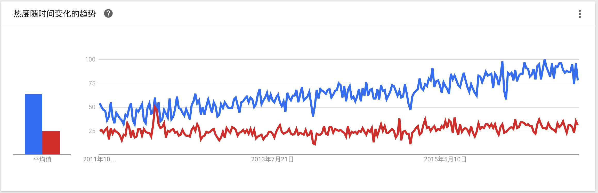
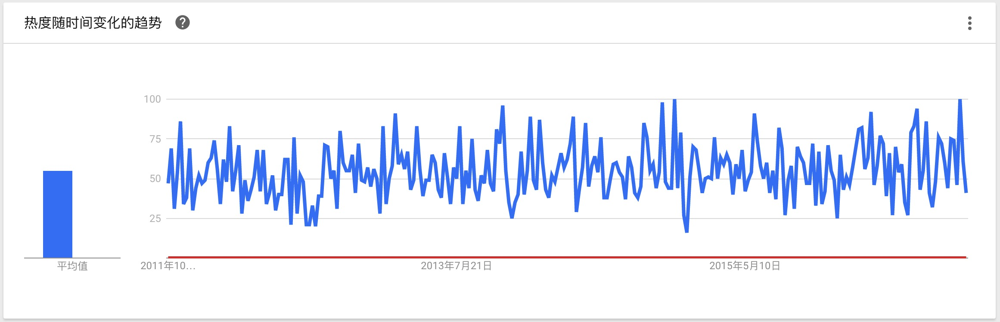

[TOC]

# 构建属于你的工具链

## 引子：语言圣战

**Python or R?**这是任何一个新入行者首先被问到的问题。你会被一群Stats们忽悠说R是调包侠的天堂，而Pythonista们又乐此不疲地给你解释Python的优雅。

### 受欢迎程度

作为一个数据工作者，当然，要用数据说话，看看这场圣战的结果。一个简单的解决方案是查看[Google趋势](https://www.google.com/trends/)的数据，通过搜索量可以基本衡量两种语言的热度。显然，通过下图可以基本得出，在这场圣战之中，R略胜一筹。

>  图片选自_谷歌趋势_（截止2016年9月28日），红线Python，蓝线R，绿线Scala，黄线Julia。

但作为一个数据工作者，当然不能简单地下结论：**R比Python更受欢迎**。首先，可以提出的另一个问题是，**不同数据亚领域里面，哪门语言更受欢迎？**（下图中红线均表示R、蓝线表示Python）

1. NLP（Python胜利）

  

2. 数据分析（R胜利）

  

3. 机器学习（Python经过挣扎之后胜利）

  

4. 统计学（R完胜）

  

5. 爬虫（Python绝对优势胜利）

  

6. 大数据\(R略胜\)

  

7. 数据库（Python胜利）

  

8. 非关系型数据库（Python完胜）

  

因此，我们这个问题可以引申为**如果我要选择数据工作中的某一个专门领域，应该选择什么哪一门语言？**

当然，作为一个合格的数据工作者应该思考，我们选择的数据是否：

1. 具有数据偏性（Bias）。
2. 是不是足够支持我们的结论。

显然，采用英文搜索google的人往往代表了使用英语并且不在国内（可以科学上网）的样本，这个样本是具有偏性的；此外，数据只是支持语言受欢迎的程度，和我们是否选择该语言并没有直接关系（只能作为一个参考标准）。

因此，我们通过上面的数据得到的结论是：**英语国家中，R较Python更受欢迎，其中更多人会选择用R做统计、数据分析相关工作，而更愿意选择用Python做文本、爬虫、机器学习相关的工作**。

>  关于受欢迎程度的研究还可以看[这篇博文](http://r4stats.com/2016/06/08/r-passes-sas-in-scholarly-use-finally/).

### 领域来源

选择哪门语言作为工具的第二个理由是教育背景。

如果你不是专门的**数据科学**或**大数据**专业，基本上，具有数据背景的有两类人：

1. 统计学背景
2. 计算机领域

而统计学背景的人往往可能有**SAS**、**R**、**SPSS**、**matlab**等语言背景，统计模型在R语言里也相对完善，因此，选择R是一个不错的开始。

计算机背景的人往往接受过OOP（Object-Orient Programming）编程范式的教育，注重工程化，选择的数据的工作也可能更偏工程和科学计算，**Python**是一个不错的选择。

### 你的进击路线

当然，最后也是比较关键的是你最后想要进击的数据工作的方向，基本上建议如下：

| 领域            | 语言         |
| ------------- | ---------- |
| 统计模型偏多的数据分析   | R          |
| 机器学习模型偏多的数据分析 | Python     |
| 数据可视化         | JavaScript |
| 数据工程类         | Python     |

### 打破语言迷思

可能上面三个侧重点无法满意地回答你的问题，你还是在选择语言上很困惑。此时，你的选择成本过高了，可以考虑直接随机地选择某一门语言，首先Action，然后在工作中体会那门语言的优势及劣势，最后，考虑是否更换语言，或者基于手头的工作什么能更快速地实现就选择什么工具。

## 数据科学家的工具链

在这里采用的数据科学一词，是狭义上的数据科学，即**数据分析/挖掘**。数据工程师的工具链相当多样复杂，在此不做讨论。

而一个典型的数据科学家的工作流包括：

1. 提出问题/接受问题
2. 基于问题采集数据
3. 数据探索（EDA）
4. 建模与模型评估
5. 得出结论并提出结论带来的决策和行动
6. 交流、讨论

而因此，一条完整的数据科学家的工具链为：

1. IO工具
2. 报告撰写工具
3. 数据分析/挖掘工具
4. 结论实践工具
5. 报告展示工具

而一条数据科学工具链是否优质的判断标准为：

1. 是否提供完整的工具链
2. 是否可形成团队统一、便捷的报告存储、记录、分享模式
3. 是否可以减少数据切换的频次

我们将分别解释这些标准。

### 完整的工具链

显然，基于数据科学家（/分析师）的工作流，我们的工具链首先必须是完整的。如果缺少一部分，则很有可能导致整个团队工作不畅。无法进行分析挖掘工作或者讲模型转为某种实践的方案。

### 分析报告

首先，一个工业领域分析的问题永远要注意的是，做的任何事都能转为一个**行动**。任何一个分析如果没有转化为行动，这件事其实是无意义的。而转为行动的第一部，往往就是交流，不论是团队内或者与业务部门，能够递交的结果的形式往往就是一份分析报告。

既然是分析报告，那这个工具链所具有的特征应该有：

1. 报告本身最好是一个个人工作的存档，因此，报告应该要记录整个分析过程（甚至失败）
2. 报告工具最好便于数据工作者方便的连接所在公司的数据仓库（这对于访问数据有权限的公司来说很必要），载入程序包，因此部分分析工作在内网服务器上很有必要
3. 报告工具要方便整理、团队内部的查看
4. 报告工具有快速实现成可与其他团队交流的转换工具
5. （弱）报告工具最好在主题上可以保证团队统一又具有公司元素特征（包括报告本身、可视化元素的主题）

### 工具切换

因为整个工作流上不免会有工具的转换，比如：最终结果是个数据DashBoard或者一份Slides。因此，好的工具链必须做到之间切换的方便，不必在工具切换上花费太多的时间。

## 常见的工具举例

在这里，我们介绍一些可以同时被数据工作者和终端业务部门同时使用的工具。试图解决工具链统一的问题。

### Jupyter

[Jupyter](http://jupyter.org/)是一个基于Ipython开发的Notebook形式的分析工具，特点是，可以直接连接Ipython Kernel实现编码的功能。但事实上，Jupyter除了支持python外，还支持R、Scala、Julia等各类数据分析可以使用的语言，而本身Jupyter就是以`Julia`、`python`和`R`拼接的词语。Jupyter的下一带产品`JupyterLab`试图完成一个浏览器IDE，希望大家可以持续关注。

Jupyter的地方方插件，`jupyter_dashboards`的出现，也使得Jupyter不仅可以作为一个分析工具，而且可以作为一个仪表盘、分析报告的展示工具。这是一个极具诱惑的特性。但是，Jupyter仪表板本身也有劣势，即，Jupyter的数据刷新是基于Ipython kernel交互的，因此，Jupyter无法做到自动的数据刷新，仪表盘的结果是静态的。

一个常见的解决方案是基于`Ipywidget`开发可以和后台直接交互的代码工具，但是问题也是显然的，首先，Dashboard无法和Tableau等常见仪表盘工具一样，可以离线直接通过SQL connector进行数据刷新，而是需要Notebook本身处在活跃状态并手动进行刷新。对于业务部门而言，学习代价太高。

### Knitr + R Notebook 

去年（2016年），RStudio宣布新一代产品`R Notebook`上线，试图实现Jupyter的功能。由此，以R语言为技术栈的数据科学家可以直接使用R的工具构造一条自己的工具链。通过，`R Notebook`直接可以实现Jupyter的所有功能，此外也有基于`shiny`包的在线显示。可以说，R生态圈也可以完全胜任这个工具链工作。

### Superset

[Superset](http://airbnb.io/superset/)是一个Airbnb开发的开源BI工具，如果你的数据团队的主要工作时通过SQL展示数据指标，那么Superset是你绝佳的选择。自动刷新数据，SQL Labs直接编辑SQL都是非常好的特性。

### Knowledge repo

[Knowledge Repo](https://github.com/airbnb/knowledge-repo)也是一个Airbnb开源的分享数据报告的工具，其主要目的是为了使得数据报告的储存、归档、团队内交流、业务部门展示可以统一在一个工具内。

